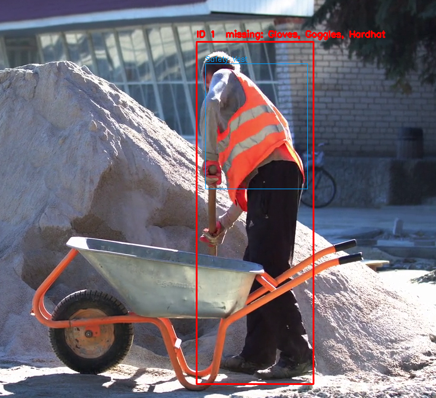

# PPE Compliance Monitor

Real-time detection of **personal protective equipment (PPE)** on a video feed, with
**per-worker violation tracking** and **automated, regulation-grounded compliance reports**.

Built as an end-to-end computer-vision + LLM pipeline: a fine-tuned YOLOv8 model spots
PPE, a tracker turns noisy frame-by-frame detections into stable per-person violation
episodes, and a RAG agent writes a compliance report citing the relevant German
occupational-safety regulations.



*Each worker is tracked (`ID 1`) and labelled green (compliant) or red with the exact
missing items (`missing: Gloves, Goggles, Hardhat`).*

---

## Highlights

- **Two-stage detection** — a general person detector (YOLOv8) runs alongside a
  fine-tuned PPE model, so PPE is attributed to *individual workers*, not just the frame.
- **Spatial association** — each PPE box is assigned to the person it most overlaps
  (containment ratio), so background detections can't be credited to the wrong worker.
- **Temporal debouncing** — a `ViolationTracker` state machine only logs a violation
  after non-compliance holds for N frames, and closes it once compliance returns,
  keeping the audit log sparse and meaningful (start/end episodes, not per-frame spam).
- **Structured audit trail** — violations are written as append-only JSONL with
  per-person IDs, missing items, and durations.
- **RAG reporting agent** — a LangChain agent reads the violation summary and, for each
  missing-PPE type, retrieves the relevant regulation from a Chroma vector store of
  German safety PDFs, then writes a cited Markdown compliance report.

## Architecture

```
video ─▶ YOLOv8 (person + PPE) ─▶ associate PPE→person ─▶ ViolationTracker ─▶ violations.jsonl
                                                                                      │
                                                          aggregate summary ◀─────────┘
                                                                  │
                                              LangChain agent + RAG (Chroma)
                                                                  │
                                                       compliance_report_<date>.md
```

## Tech stack

`Python` · `Ultralytics YOLOv8` · `OpenCV` · `LangChain` · `Chroma` ·
`sentence-transformers` · `OpenAI` · `DVC`

## Model & data

- **Detection model** — YOLOv8s fine-tuned on the Roboflow *Personal Protective
  Equipment – Combined Model* dataset (v8), 50 epochs at 640px.
- **Performance** (validation) — mAP@50 **0.78**, mAP@50-95 **0.51**, precision **0.71**,
  recall **0.84**. Per-class recall: **0.93** hardhat, **0.99** goggles, **0.95** gloves.
- **Training curves & confusion matrix** — see [`docs/training/`](docs/training/).
- **Regulations corpus** — the DGUV rules used by the RAG agent are copyrighted and are
  **not committed**. Populate `data/regulations/` from the official sources before
  building the index — [publikationen.dguv.de](https://publikationen.dguv.de) for the
  DGUV Regeln and [gesetze-im-internet.de](https://www.gesetze-im-internet.de) for
  ArbSchG and the PSA-Benutzungsverordnung.

## Project structure

```
main.py                      # live detection loop (entry point)
configs/config.yaml          # all tunable parameters
src/
  core/
    detection.py             # YOLO load + person tracking + PPE detection
    association.py           # assign PPE boxes to people (containment)
    violation_tracker.py     # debounced per-person violation episodes
  utils/
    overlay.py               # bounding-box / label drawing
    audit_logger.py          # JSONL violation log
    config_loader.py
  agent/
    rag_index.py             # one-time: embed regulation PDFs into Chroma
    rag_tool.py              # search_regulations tool (loads vector store)
    agent.py                 # LangChain reporting agent
    aggregate.py             # summarise the violation log
    save.py
scripts/
  generate_report.py         # run the agent over the log → Markdown report
  train.py / check_classes.py
notebooks/train.ipynb        # model training (Kaggle/GPU)
```

---

## Getting started

### 1. Install

```bash
python -m venv .venv
.venv\Scripts\activate          # Windows  (macOS/Linux: source .venv/bin/activate)
pip install -r requirements.txt
```

### 2. Configure secrets

Create a `.env` file in the project root:

```
OPENAI_API_KEY=sk-...           # for the reporting agent
HF_TOKEN=hf_...                 # optional: faster embedding-model download
```

### 3. Add model weights

Weights are tracked with **DVC** and not committed to git. Either pull them
(`dvc pull`) or place your own trained `best.pt` in `models/`
(train one via `notebooks/train.ipynb`). The person detector (`yolov8n.pt`)
downloads automatically on first run.

### 4. Run live detection

```bash
python main.py                  # press Q to quit
```

Set the input in `configs/config.yaml` → `camera.source` (`0` for a webcam, or a
video path). Violations are written to `logs/violations.jsonl`.

### 5. Build the regulation index (one time)

```bash
python -m src.agent.rag_index   # embeds PDFs in data/regulations/ into Chroma
```

### 6. Generate a compliance report

```bash
python -m scripts.generate_report
# → reports/compliance_report_<date>.md
```

---

## Configuration

All behaviour is driven by [`configs/config.yaml`](configs/config.yaml) — model paths,
confidence thresholds, required PPE classes, and the violation debouncing windows
(`confirm_after`, `clear_after`, `forget_after`). No code changes needed to retune.
